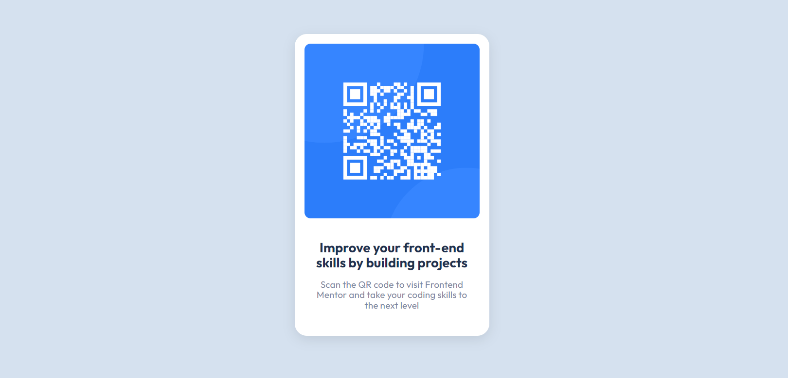

# QR Code Component 

- [Overview](#overview)
  - [Screenshot](#screenshot)
  - [Links](#links)
- [My process](#my-process)
  - [Built with](#built-with)
  - [Steps](#steps)
  - [What I learned](#what-i-learned)
  - [Continued development](#continued-development)
  - [Useful resources](#useful-resources)
- [Author](#author)
- [Acknowledgments](#acknowledgments)

## Overview
- A QR code card for basic HTML and CSS. No responsive layouts needed. Figma was used for the design.

### Screenshot

### Links
- Solution URL:
 https://github.com/Dev-Wy/QR-code
- Live Site URL:
 https://dev-wy.github.io/QR-code/

## My Process
### Built with
- HTML
- CSS

### Steps
- I looked at the attributes in the Figma design, copied the fonts from GoogleFonts, and planned out my QR-code build. After formatting the HTML to have a contact-wrapper around the card and a text-wrapper around the h1 and p elements, I started work on the CSS. 

- I formatted the fonts, aligned the text, and added paddings and margins. Then I adjusted the box-radius and matched the colors. After the initial submittion, I added a desktop media screen to adjust the card placement and validated my code.

### What I learned
- This was my first time working with Figma. I learned where the color codes are and really enjoyed the Alt key feature to measure distances between items.

### Continued development
- I'd like to become more familiar the with box-shadow elements. 

### Useful Resources: 
- I love W3C School's validation services. 
- https://validator.w3.org/   
- https://jigsaw.w3.org/css-validator/

## Author
- Jake Wyant
- Portfolio: https://dev-wy.github.io/Portfolio/
- Frontend Mentor - [@Dev-Wy](https://www.frontendmentor.io/profile/Dev-Wy)

## Acknowledgments
- Thanks to Frontend Mentor for this project.
- W3C for their resources. 
- Special thanks to Skillcrush for giving me the foundation to build on.
